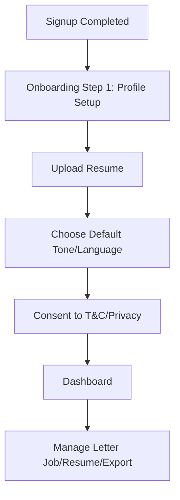

# User Journey & Flow Documentation (cover.me)

## Overview

This document outlines the end-to-end user flows for cover.me, the AI cover letter writer. All charts and journeys are tailored to real-world job applicant and cover letter generation processes.

---

## Flow 1: Landing Page → Job/Resume Intake → Letter Generation → Export/Signup
```mermaid
flowchart TD
    A[User lands on cover.me] --> B[Landing Page CTA]
    B --> C[Upload Resume (PDF/DOCX) or Fill Job Description]
    C --> D[Parse/validate resume + job]
    D --> E{User Authenticated?}
    E -->|No| F[Prompt signup/login]
    E -->|Yes| G[Letter Generation Form]
    F --> H[Signup via email/Google]
    H --> G
    G --> I[Select Tone/Language → Generate Cover Letter]
    I --> J[Streaming Letter Preview]
    J --> K[Letter Edit/Accept]
    K --> L[Version Hist/Review]
    L --> M[Export (PDF/DOCX/Clipboard)]
    M --> N[Optional: Share via Email (rate-limited, verified only)]
    N --> O[User completes journey]
```

---

## Flow 2: Onboarding/Account Settings


---

## Flow 3: Data Export & Account Deletion (GDPR)
```mermaid
flowchart TD
    A[User in Settings] --> B[Request Data Export]
    B --> C[Backend bundles all user PII (resume, jobs, letters, consents)]
    C --> D[User downloads data.json]
    A --> E[Request Account Deletion]
    E --> F[Confirm intent/password]
    F --> G[Soft-delete (30 days)]
    G --> H[Hard delete/anonymize]
```

---

## TODO-REWRITE
All education-specific flows or diagrams left must be substituted with the above or deleted.